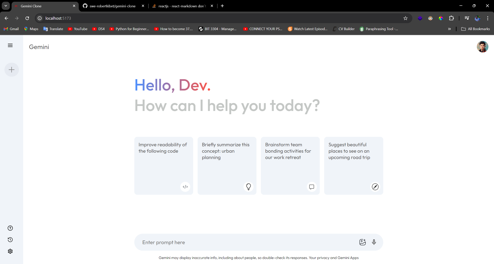

# Gemini Clone



A React-based clone of the Gemini AI interface, providing a sleek and intuitive user experience for interacting with an AI assistant.

[Live Demo](https://gemini.robertkibet.com)

## Table of Contents

- [Features](#features)
- [Technologies Used](#technologies-used)
- [Getting Started](#getting-started)
  - [Prerequisites](#prerequisites)
  - [Installation](#installation)
- [Usage](#usage)
- [Project Structure](#project-structure)
- [Customization](#customization)
- [Contributing](#contributing)
- [License](#license)
- [Acknowledgements](#acknowledgements)

## Features

- **Responsive Design**: Adapts seamlessly to various screen sizes and devices.
- **AI Interaction**: Simulates conversations with an AI assistant.
- **Markdown Rendering**: Supports markdown formatting in AI responses.
- **Syntax Highlighting**: Provides syntax highlighting for code snippets in responses.
- **Dynamic UI**: Includes loading animations and a clean, modern interface.

## Technologies Used

- React.js
- CSS3
- react-markdown
- react-syntax-highlighter
- rehype-raw (for HTML parsing in markdown)

## Getting Started

Follow these instructions to get a copy of the project up and running on your local machine for development and testing purposes.

### Prerequisites

- Node.js (v14.0.0 or later)
- npm (v6.0.0 or later)

### Installation

1. Clone the repository:

   ```
   git clone https://github.com/swe-robertkibet/gemini-clone.git
   ```

2. Navigate to the project directory:

   ```
   cd gemini-clone
   ```

3. Install dependencies:

   ```
   npm install
   ```

4. Start the development server:

   ```
   npm run dev
   ```

5. Open [http://localhost:5173](http://localhost:5173) to view it in the browser.

## Usage

1. Type your question or prompt in the input field at the bottom of the page.
2. Press Enter or click the send button to submit your query.
3. The AI response will appear in the main content area, with proper formatting for text, code, and other elements.

## Project Structure

```
gemini-clone/
│
├── src/
│   ├── components/
│   │   ├── Main.jsx
│   │   └── Sidebar.jsx
│   ├── context/
│   │   └── Context.jsx
│   ├── assets/
│   │   └── assets.js
│   ├── App.js
│   └── index.js
│
├── public/
│   └── index.html
│
├── package.json
└── README.md
```

## Customization

- To modify the UI, edit the CSS files associated with each component.
- To change the AI interaction logic, update the `Context.jsx` file.
- To add new features, create new components in the `components/` directory and import them as needed.

## Contributing

Contributions are welcome! Please feel free to submit a Pull Request.

1. Fork the project
2. Create your feature branch (`git checkout -b feature/AmazingFeature`)
3. Commit your changes (`git commit -m 'Add some AmazingFeature'`)
4. Push to the branch (`git push origin feature/AmazingFeature`)
5. Open a Pull Request

## License

This project is licensed under the MIT License - see the [LICENSE.md](LICENSE.md) file for details.

## Acknowledgements

- [React](https://reactjs.org/)
- [react-markdown](https://github.com/remarkjs/react-markdown)
- [react-syntax-highlighter](https://github.com/react-syntax-highlighter/react-syntax-highlighter)
- [Gemini AI](https://gemini.google.com/) for inspiration
